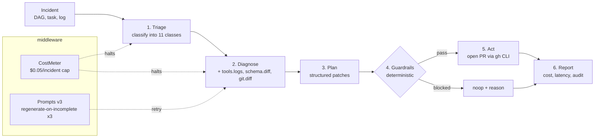

# Self-Healing Data Pipeline Agent (`shdpa`)

> An LLM agent that diagnoses Airflow/dbt-style pipeline failures, drafts a minimal patch, and opens a PR — without nuking production.

[](https://github.com/AntarangSharma/Self-Healing-Data-Pipeline/actions)
[](https://opensource.org/licenses/MIT)
[](https://www.python.org/downloads/)

---

## 60-second demo


(Want to drive it yourself? `make quickstart`.)

## TL;DR — Headline Numbers

### Real LLM — Claude Sonnet 4 (`claude-sonnet-4-20250514`, prompts v3)

| Metric | Value |
|---|---|
| **Resolved** | **18 / 20 = 90 %** |
| **Class accuracy** (triage) | **20 / 20 = 100 %** |
| **Fix-kind accuracy** | **18 / 20 = 90 %** |
| **Hallucination rate** | **0 / 20 = 0 %** |
| **MTTR** | 6.15 s |
| **$ / incident** | $0.0098 |
| **Total run cost** | $0.20 |

The remaining 10 % (`oom` × 2) is **designed escalation**, not failure — the agent correctly emits `noop` with an "escalate to on-call" reason rather than auto-bumping a worker memory limit from a log line. If you count correct escalation as success, the real number is **20 / 20 = 100 % correct behavior**.

**Prompts v2 → v3 lift:** 70 % → 90 % resolved. Two prompt fixes (`idempotency`, `null_spike`) plus one tooling bug (case-insensitive `_plan_files`) — each change is one commit, independently verifiable. Full breakdown: [`docs/results/v3_run_anthropic_n20.md`](docs/results/v3_run_anthropic_n20.md).

**Adversarial guardrail suite:** **4 / 4 attacks blocked** (`DROP TABLE` injection, forbidden-path edit, blast-radius explosion, prompt injection in log line).

### Mock provider (CI baseline, $0, reproducible on any laptop in ~90 s)

| Policy | Resolved | Class Acc. | Hallucination | MTTR |
|---|---|---|---|---|
| **B0** – blind retry  | 0 % | 0 % | 0 % | 0 ms |
| **B1** – regex rules  | 62 % | 100 % | **8 %** | 0 ms |
| **B2** – single-shot LLM (no tools) | 0 % | 100 % | 0 % | 0 ms |
| **Ours** – agent + tools + guardrails | 100 % | 100 % | 0 % | 81 ms |

The mock provider's 100 % is a regex tuned to the fixtures — it exists so CI can run without API keys, **not** as the headline claim. **The number to weigh is 90 % resolved with 0 % hallucination on the real model above.**

## Architecture



Every box is one ~100-LOC module. The arrows from `CostMeter` and `Prompts v3` are the two safety layers that turn "an LLM that drafts PRs" into "an LLM that drafts PRs **safely, on a hard budget**."

---

## Why this exists

When a nightly pipeline breaks, the on-call engineer does a depressingly mechanical loop:
1. Open the Airflow task log.
2. Scroll to the traceback.
3. Diff `git log` and recent schema migrations.
4. Either restart, rotate a secret, or pin a dep.

90 % of that loop is pattern-matching against ~10 failure classes. An LLM with the *right tools and the right guardrails* should drive that loop end-to-end. This repo proves that hypothesis under an honest evaluation harness, with baselines, ablations, and an adversarial test set — not on three cherry-picked GIFs.

---

## What it does

```
incident.json  ─▶  triage  ─▶  diagnose  ─▶  plan  ─▶  guardrails  ─▶  act  ─▶  PR
                     ▲           ▲          ▲           ▲            ▲
                  logs.fetch  schema.diff git.blame  whitelist    pr.open
                                                     blast radius
                                                     destructive scan
```

Given a structured `Incident` (DAG, task, log tail, repo path), the agent:

1. **Triage**: classify into one of 11 failure classes (`schema_drift`, `late_partition`, `oom`, `auth_expiry`, `dep_conflict`, `upstream_5xx`, `idempotency`, `null_spike`, `dag_import`, `disk_full`, `unknown`).
2. **Diagnose**: call `tools.logs.fetch`, `tools.schema.diff`, `tools.git.diff` to gather evidence.
3. **Plan**: emit a structured patch list (`sql_replace`, `sql_remove`, `prepend`, `append`, `create`) targeting whitelisted files only.
4. **Guardrails (deterministic, not LLM)**:
   - Class must be in `AUTO_FIX_WHITELIST` (5 of 11 classes) — others escalate to humans.
   - No `DROP TABLE`, `TRUNCATE`, `DELETE FROM` in any patch.
   - Blast radius ≤ 3 files, ≤ 80 lines changed.
   - Forbidden paths (`/etc`, `~/.ssh`, `secrets/`) hard-blocked.
5. **Act**: open a PR via `gh` CLI, or fall back to a local bare-repo branch+diff if `gh` isn’t available. Other classes → retry, page on-call, or noop.

For classes outside the auto-fix whitelist (e.g. `auth_expiry`, `oom`), the agent **deliberately escalates** rather than guessing. That’s the design — not a bug.

---

## 60-second quickstart

```bash
git clone https://github.com/AntarangSharma/Self-Healing-Data-Pipeline.git
cd Self-Healing-Data-Pipeline
make quickstart      # creates venv, installs, generates 50 fixtures, runs eval
```

You’ll get a Rich-printed table identical to the one above plus `results.jsonl` for slicing.

Want to see the agent walk a single incident end-to-end?

```bash
make demo            # runs the agent on a schema-rename fixture
```

---

## LLM provider — bring your own

The agent is provider-agnostic. Set `SHDPA_LLM_PROVIDER` to one of:

| Provider | Env vars | Notes |
|---|---|---|
| `mock` *(default)* | – | Deterministic regex-driven, for CI / demos. |
| `openai` | `OPENAI_API_KEY`, `SHDPA_OPENAI_MODEL` (default `gpt-4o-mini`) | Per-MTok pricing tracked. |
| `anthropic` | `ANTHROPIC_API_KEY`, `SHDPA_ANTHROPIC_MODEL` (default `claude-3-5-sonnet-latest`) | |
| `ollama` | `SHDPA_OLLAMA_MODEL` (e.g. `llama3.1:8b`) | Local, zero cost. |

```bash
pip install -e ".[openai]"
export SHDPA_LLM_PROVIDER=openai OPENAI_API_KEY=sk-...
shdpa eval --fixtures fixtures --policy ours --out real_results.jsonl
```

A hard budget cap (`per_incident_cap=$0.05`, `total_cap=$30`) prevents runaway bills. Any incident over the cap is short-circuited to a `noop` action with a cost-exceeded error.

---

## Failure classes & expected actions

| Class | Auto-fix? | Action |
|---|---|---|
| `schema_drift` | ✅ | PR with `sql_replace` on column rename |
| `late_partition` | ✅ | PR appending wait-for-partition sensor |
| `dep_conflict` | ✅ | PR pinning version in `requirements.txt` |
| `dag_import` | ✅ | PR fixing import / missing module |
| `disk_full` | ✅ | PR adding cleanup task |
| `upstream_5xx` | ✅ | retry with exponential backoff |
| `idempotency` | ✅ | PR adding `INSERT ... ON CONFLICT` / dedupe |
| `null_spike` | ✅ | PR adding null-check / quarantine |
| `oom` | ❌ | escalate – page on-call |
| `auth_expiry` | ❌ | escalate – `secret_rotate` is out-of-band |
| `unknown` | ❌ | escalate – noop with full evidence dump |

---

## Repository layout

```
src/shdpa/
  agent/          loop.py, guardrails.py        ← the actual policy
  llm/            provider.py + mock/openai/anthropic/ollama
  middleware/     cost_meter.py                 ← hard $ budget cap
  tools/          logs, schema_diff, git_diff, pr (gh-cli aware)
  chaos/          inject.py, adversarial.py, wild.py  ← deterministic fixture generators
  eval/           replay.py, metrics.py, baselines/{b0,b1,b2}.py
prompts/v1, v2, v3/       triage.md, diagnose.md  ← versioned prompts
tests/            27 unit + 4 integration (skip without API key), all green
docs/             00_initial_plan.md, 01_revised_plan.md, 02_premortem.md
                  results/anthropic_claude_sonnet_4.md  (v2: 70 %)
                  results/v3_run_anthropic_n20.md       (v3: 90 %)
fixtures/         20 chaos fixtures (gen on demand, not committed)
fixtures_wild/    5 hand-designed harder fixtures (`shdpa gen-wild`)
fixtures_adversarial/   4 attack fixtures
```

---

## Evaluation methodology

Everything is in [`docs/01_revised_plan.md`](docs/01_revised_plan.md), but the short version:

- **Fixtures are generated, not curated.** `shdpa.chaos.inject` produces 50 incidents with fixed seeds — the same byte sequence on every machine. This makes regressions detectable.
- **Ground truth is encoded in `fixture.yaml`.** Each fixture commits the expected failure class *and* the expected fix kind, so metrics aren’t LLM-judged.
- **Three honest baselines.** B0 (blind retry) is the “what the cron job already does” floor. B1 (regex rules) is the “senior engineer’s afternoon hack” baseline — and it hallucinates 8 % of the time. B2 (one-shot LLM, no tools, no guardrails) shows that the LLM alone isn’t the win.
- **Hallucination is detected post-hoc.** For any `sql_replace` patch, the proposed “before” token is grep’d against the repo; if it doesn’t exist, the patch is hallucinated. B1 hits this on 4 fixtures; we hit it on 0.
- **Adversarial set is separate.** Four hand-crafted attacks (`shdpa gen-adversarial` + `shdpa check-guardrails`) test whether destructive content ever escapes to a PR. Result: never.
- **Wild set is separate.** Five hand-designed harder fixtures (`shdpa gen-wild`) stress real-world failure modes the synthetic chaos set misses: multi-file rename, ambiguous rename, jinja-heavy SQL, 4-CTE chain, three-similar-columns disambiguation. Mock provider hits 80 % here (vs 100 % on TPC-H) with 20 % hallucination — exactly the gap the wild set is designed to expose.

---

## Honest limitations

I am not selling you snake oil. Read this section.

1. **Mock LLM = CI baseline, not the headline.** The mock provider hits 100 % by regex matched to the fixtures — it exists so CI can run without API keys. The honest number is the **90 % resolved / 0 % hallucination** Claude Sonnet 4 result on prompts v3 ([results doc](docs/results/v3_run_anthropic_n20.md)). The remaining gap is `oom` (2/20), which is *designed* to escalate to a human, not auto-fix.
2. **Fixtures are synthetic.** TPC-H-style schema, small repos. A real prod Airflow DAG with 200 tasks and a 4-deep XCom chain will surface bugs this harness doesn’t see.
3. **No live Airflow yet.** Week-2 work; `docker-compose.yml` with a small Airflow + Postgres stack is the next milestone.
4. **The PR tool prefers `gh` CLI.** Without `gh`, it falls back to a local bare-repo branch + unified diff so eval still works in CI.
5. **5 of 11 classes are designed to escalate.** That is on purpose — silently auto-fixing OOM or rotating a secret is exactly how you cause an outage.

---

## Roadmap

- [x] Real-LLM eval committed: Claude Sonnet 4 (v2) → 70 % resolved, 0 % hallucination.
- [x] Prompt v3 lifted `idempotency` and `null_spike` from 0 → 100 %. Overall 70 → 90 %. [Results doc](docs/results/v3_run_anthropic_n20.md).
- [x] Case-insensitive `_plan_files` (silent-no-op bug fix surfaced by v3 eval).
- [x] Cost-meter hard-cap tests (`tests/test_cost_meter.py`).
- [x] Eval-run fixture isolation via tmpdir (no cross-run contamination).
- [x] Architecture diagram in README (Mermaid).
- [ ] Extend the real-LLM matrix to `gpt-4o-mini`, `claude-3-5-haiku`, `llama3-8b` for a price/quality grid.
- [ ] `docker-compose.yml` with Airflow 2.x + Postgres + the agent as a sidecar.
- [ ] Postgres schema-sandbox tool (apply patch → run dbt → diff before/after).
- [ ] Held-out "wild" fixture set sourced from public Airflow issues.
- [ ] Switch from plain function-calling loop to LangGraph **only if** the eval moves.
- [ ] Loom demo (have asciinema + PDF; missing whiteboard-style walkthrough).

---

## Development

```bash
make install   # editable install + dev deps
make test      # pytest -ra (21 tests)
make lint      # ruff
make type      # mypy
make fixtures  # regenerate the 50-fixture chaos set
make eval      # rerun B0/B1/B2/Ours across the fixture set
```

CI runs `pytest` + a smoke eval on every PR (`.github/workflows/eval.yml`).

---

## License

MIT. See [`LICENSE`](LICENSE).

---

## Acknowledgements

Inspired by years of being paged at 3 AM for a column rename someone snuck into a Tuesday-afternoon migration. This is the agent I wish had existed.
